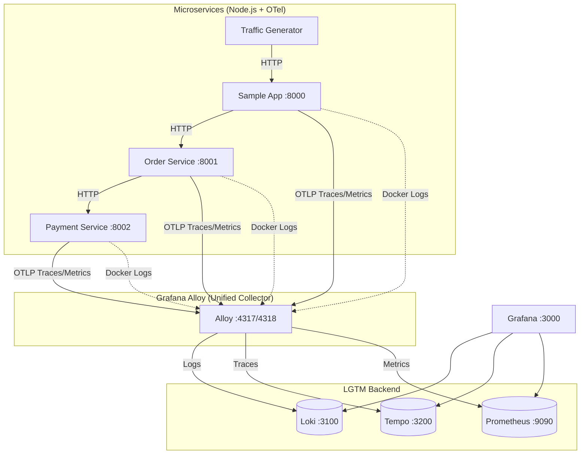

# LGTM Observability Stack

A complete **LGTM** (Loki, Grafana, Tempo, Mimir/Prometheus) observability stack for distributed microservices. This project demonstrates how to implement comprehensive monitoring—**logging, metrics, and tracing**—for a Node.js microservices architecture using **OpenTelemetry** and **Grafana Alloy**.

## 🏗️ Architecture



---

## 🚀 Components

| Component         | Version | Description                                                  |
| ----------------- | ------- | ------------------------------------------------------------ |
| **Grafana**       | 10.2.3  | Unified visualization dashboard                              |
| **Grafana Alloy** | 1.4.2   | OpenTelemetry collector (replaces Promtail + OTel Collector) |
| **Prometheus**    | 2.48.0  | Time-series metrics database                                 |
| **Loki**          | 2.9.3   | Log aggregation system                                       |
| **Tempo**         | 2.3.1   | Distributed tracing backend                                  |
| **Node Exporter** | 1.7.0   | Host metrics exporter                                        |

### Microservices

| Service         | Port | Description               |
| --------------- | ---- | ------------------------- |
| sample-app      | 8000 | API Gateway / Entry point |
| order-service   | 8001 | Order processing          |
| payment-service | 8002 | Payment handling          |

All services are instrumented with **OpenTelemetry Node.js SDK**.

## 🛠️ Two Ways to Learn

This project supports **two deployment methods**, each teaching different skills:

| Approach           | Best For                       | What You'll Learn                                          |
| ------------------ | ------------------------------ | ---------------------------------------------------------- |
| **Docker Compose** | Local development, quick start | Container networking, volume mounts, compose orchestration |
| **Kubernetes**     | Production simulation          | Helm charts, namespaces, Ingress, cloud deployment         |

> **Recommendation:** Start with Docker Compose to understand the stack, then move to Kubernetes to learn production patterns.

---

## 🐳 Option 1: Docker Compose (Local Development)

The fastest way to run the entire stack locally. No cloud account needed.

```bash
cd docker
docker-compose up -d --build
```

### Access Points

| Component      | URL                    | Credentials       |
| -------------- | ---------------------- | ----------------- |
| **Grafana**    | http://localhost:3000  | `admin` / `admin` |
| **Prometheus** | http://localhost:9090  | -                 |
| **Loki**       | http://localhost:3100  | -                 |
| **Tempo**      | http://localhost:3200  | -                 |
| **Alloy UI**   | http://localhost:12345 | -                 |
| **Sample App** | http://localhost:8000  | -                 |

> **Note:** A `traffic-generator` container automatically sends requests to generate observability data.

### Generate Traffic Manually

```bash
./generate_traffic.sh
```

---

## ☸️ Option 2: Kubernetes (Production-Ready)

Deploy to a real Kubernetes cluster. Supports **minikube**, **kind**, **GKE**, **EKS**, or **AKS**.

```bash
cd k8s
./deploy.sh
```

See [k8s/README.md](k8s/README.md) for:

- **Local clusters:** Minikube and Kind setup instructions
- **Cloud clusters:** GKE/EKS/AKS with container registry
- **Helm charts:** What each chart does and how to customize
- **Ingress:** External access configuration

---

## 📈 Features

- **Distributed Tracing:** Full trace propagation from `sample-app` → `order-service` → `payment-service`
- **Trace-Log Correlation:** Jump from a trace in Tempo directly to relevant logs in Loki
- **Unified Collection:** Grafana Alloy collects logs, metrics, and traces in one agent
- **Auto-Instrumentation:** Node.js services use `@opentelemetry/auto-instrumentations-node`
- **Pre-configured Dashboards:** Grafana provisioning with data sources pre-wired

---

## 📁 Project Structure

```
├── docker/                     # Local development setup
│   ├── docker-compose.yml      # Full stack definition
│   ├── alloy/                  # Alloy (OTel collector) config
│   ├── grafana/                # Grafana provisioning
│   ├── loki/                   # Loki config
│   ├── prometheus/             # Prometheus config
│   └── tempo/                  # Tempo config
├── k8s/                        # Kubernetes manifests & Helm
│   ├── apps/                   # Application deployments
│   ├── helm/                   # Helm value files
│   └── deploy.sh               # Deployment script
├── sample-app/                 # Gateway service (Node.js)
├── order-service/              # Order processing (Node.js)
├── payment-service/            # Payment handling (Node.js)
├── docs/                       # Learning modules
└── generate_traffic.sh         # Traffic generation script
```

---

## 📚 Learning Path

New to observability? Start with these deep-dive modules:

| Module                                | Topic                    | Description                                     |
| ------------------------------------- | ------------------------ | ----------------------------------------------- |
| [01](docs/01-observability-intro.md)  | **Why Observability?**   | Three pillars, monitoring vs observability      |
| [02](docs/02-prometheus-deep-dive.md) | **Prometheus Deep Dive** | Metrics, PromQL, pull model                     |
| [03](docs/03-loki-deep-dive.md)       | **Loki Deep Dive**       | Log aggregation, LogQL, index-free design       |
| [04](docs/04-tempo-deep-dive.md)      | **Tempo Deep Dive**      | Distributed tracing, spans, context propagation |

---

## 🔧 Configuration

### Environment Variables (Microservices)

| Variable              | Description                   |
| --------------------- | ----------------------------- |
| `ORDER_SERVICE_URL`   | URL for order service         |
| `PAYMENT_SERVICE_URL` | URL for payment service       |
| `OTLP_ENDPOINT`       | Alloy/Collector OTLP endpoint |

### Adding a New Service

1. Instrument with OpenTelemetry SDK
2. Set `OTLP_ENDPOINT` to point to Alloy
3. Add to `docker-compose.yml` or `k8s/apps/`
4. Update Prometheus scrape config if exposing `/metrics`

---

## 📄 License

ISC
